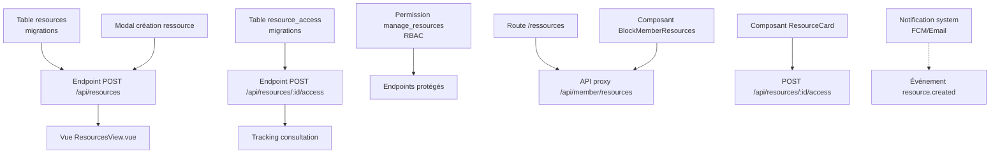

# Scénario fonctionnel — Partage de ressources par le pasteur

## 📋 Résumé exécutif

**Objectif** : Le pasteur doit pouvoir envoyer une ressource (document, lien, message) à un membre et suivre si celui-ci l'a consultée.

**Manque actuel** : ❌ 100% non implémenté

**Réutilisable** : ✅ Pattern des messages avec `read_at` + système d'authentification existant

**Effort estimé** : 🟡 Modéré (2-3 jours backend + 3-4 jours frontend)

---

## 🎭 Acteurs

- **Pasteur/Admin** : authentifié via Firebase, a accès à l'interface d'administration
- **Membre** : authentifié via le système de membres (Firebase ou compte dédié)
- **Système** : eglise-cieux-ouverts (site public Nuxt) ↔ eglise-app (Worker backend)

---

## 🔄 Flux fonctionnel optimal

```
┌─────────────┐     ┌──────────────┐     ┌──────────────┐     ┌─────────────┐
│   Pasteur   │     │ eglise-app   │     │    Membre    │     │eglise-app DB│
│  (admin)    │     │   (Worker)   │     │ (connecté)   │     │    (D1)     │
└──────┬──────┘     └──────┬───────┘     └──────┬───────┘     └──────┬──────┘
       │                    │                    │                    │
       │ 1. Crée ressource  │                    │                    │
       │    (titre, membre,│                    │                    │
       │    URL/fichier)   │                    │                    │
       ├───────────────────►│                    │                    │
       │                    │ 2. INSERT INTO    │                    │
       │                    │    resources       │                    │
       │                    ├────────────────────►                    │
       │                    │                    │ 3. Notification   │
       │                    │                    │   (email/push)     │
       │                    │ ◄──────────────────┤                    │
       │                    │                    │                    │
       │                    │                    │ 4. GET /api/member/ │
       │                    │ ◄──────────────────┤   resources         │
       │                    │                    │                    │
       │                    │ 5. Retourne les  │                    │
       │                    │   ressources       │                    │
       │                    ├───────────────────►│                    │
       │                    │                    │ 6. Consulte       │
       │                    │                    │   (clic)           │
       │                    │ ◄──────────────────┤                    │
       │                    │    7. POST /api/   │                    │
       │                    │       resources/:id/access            │
       │                    ├───────────────────────────────────────►
       │                    │                    │                    │
       │                    │ 8. UPDATE resource_access              │
       │                    │ ◄─────────────────────────────────────┤
       │ 9. Voir suivi     │                    │                    │
       │    (statut lu)    │                    │                    │
       │ ◄────────────────┤                    │                    │
       └──────────────────┘                    └────────────────────┘
```

---

## ✅ Checklist des éléments à implémenter

### Backend (eglise-app) - 7 items

- [ ] Table `resources` (migrations)
- [ ] Table `resource_access` (migrations)
- [ ] Endpoint `POST /api/resources`
- [ ] Endpoint `GET /api/resources`
- [ ] Endpoint `GET /api/member/resources`
- [ ] Endpoint `POST /api/resources/:id/access`
- [ ] Permission `manage_resources` dans RBAC

### Frontend public (eglise-cieux-ouverts) - 4 items

- [ ] Route `/ressources` ou `/member`
- [ ] Composant `BlockMemberResources.vue`
- [ ] Composant `ResourceCard.vue`
- [ ] Store `useResources()`

### Frontend admin (eglise-app) - 4 items

- [ ] Vue `ResourcesView.vue`
- [ ] Modal création ressource
- [ ] Colonne "Consultée par" + filtre
- [ ] Dashboard suivi consultations

---

## Parcours du pasteur (actions possibles actuellement)

### 1. Création d'une ressource ciblée

**Actions possibles actuellement :**
- ✅ Le pasteur peut créer une **annonce** via `Annonces.vue` (eglise-app) → `POST /api/announcements`
- ✅ Le pasteur peut créer un **message** via `MessagesView.vue` (eglise-app) → `POST /api/messages`
- ❌ Aucun des deux ne permet de cibler un membre spécifique (destinataire unique)
- ❌ Aucun mécanisme de "ressource" avec suivi de consultation

**Ce qui manque :**
- Type de bloc `resource` ou `memberResource` dans `utils/blockTypes.js`
- Endpoint `POST /api/resources` dans eglise-app
- Table `resources` dans D1 (avec `member_id`, `resource_url`, `resource_type`, `accessed_at`, ... )
- Interface UI pour créer une ressource ciblée
- Dashboard de suivi des consultations

### 2. Administration de la ressource

**Actions possibles actuellement :**
- ✅ Le pasteur voit les **membres** via l'endpoint `GET /api/members` (proxy via `/api/members.get.ts`)
- ✅ Le pasteur peut accéder à la liste des **messages** via `MessagesView.vue` (eglise-app)
- ❌ Pas de vue "Ressources" dans l'admin du site public
- ❌ Pas de suivi d'ouverture/consultation

---

## Parcours du membre (actions possibles actuellement)

### 1. Accès à la ressource

**Actions possibles actuellement :**
- ❌ Aucune page `/member` ou `/ressources` dans eglise-cieux-ouverts
- ❌ Aucun système d'authentification "compte membre" côté site public
- ❌ Aucun endpoint `GET /api/member/resources` accessible
- ❌ Aucun widget "Mes ressources" dans l'interface

**Ce qui manque :**
- Page dédiée aux membres (authentification)
- Endpoint API pour récupérer les ressources assignées à un membre
- Composant `BlockMemberResources.vue` ou intégration dans une page perso
- Mécanisme de "marquage comme lu" ou "consulté"

---

## Analyse technique détaillée

### Infrastructure existante

| Élément | Emplacement | Status |
|---------|-------------|--------|
| Authentification Firebase | `plugins/firebase.client.ts` | ✅ Client-only, fonctionnelle |
| Roles/RBAC | `src/auth.js` (eglise-app) | ✅ 7 rôles définis |
| Membres (CRUD) | `src/routes/members.js` + `MembersList.vue` | ✅ Complet avec pagination |
| Messages internes | `src/routes/messages.js` + `MessagesView.vue` | ✅ Avec suivi `read_at` |
| Annonces/publipostage | `src/routes/announcements.js` + `Annonces.vue` | ✅ CRUD, mais pan audience |
| Modèle "Équipe" (blocs) | `BLOCK_TYPES.equipe` dans `blockTypes.js` | ✅ Affiche les membres d'une équipe |
| API proxy membres | `server/api/members.get.ts` | ✅ Fonctionnel |

### Ce qui existe déjà (partiallement reusable)

**Messages internes** (`messages.js`) :
- ✅ Table `messages` avec `sender_id`, `subject`, `content`, `created_at`
- ✅ Table `message_recipients` avec `read_at` (tracking ✅)
- ✅ Endpoint `POST /api/messages/:id/read` pour marquer comme lu

**Problème** : Les messages sont **multidestinataires** (array), pas un lien direct ressource→membre avec tracking granularisé.

---

## Éléments manquants critiques

### 1. Backend (eglise-app)

| Élément | Description | Priorité |
|---------|-------------|----------|
| Table `resources` | `id`, `title`, `description`, `url`, `file_url`, `type`, `created_by`, `created_at`, `expires_at` | 🔴 Haute |
| Table `resource_access` | `resource_id`, `member_id`, `accessed_at`, `ip_address`, `user_agent` | 🔴 Haute |
| Endpoint `POST /api/resources` | Création ressource ciblée | 🔴 Haute |
| Endpoint `GET /api/resources` | Liste ressources (admin) | 🔴 Haute |
| Endpoint `GET /api/member/resources` | Ressources pour le membre connecté | 🔴 Haute |
| Endpoint `POST /api/resources/:id/access` | Marquer consultation | 🔴 Haute |
| Permission `manage_resources` | RBAC pour cette fonction | 🟡 Moyenne |

### 2. Frontend public (eglise-cieux-ouverts)

| Élément | Description | Priorité |
|---------|-------------|----------|
| Route `/member` ou `/ressources` | Page perso membre | 🔴 Haute |
| Composant `BlockMemberResources.vue` | Bloc pour afficher les ressources | 🔴 Haute |
| Composant `ResourceCard.vue` | Card avec bouton "Marquer comme lu" | 🔴 Haute |
| Store/Pinia `useResources()` | Gestion état ressources côté client | 🟡 Moyenne |
| Page `/login/member` | Authentification membre (si besoin) | 🟡 Moyenne |

### 3. Frontend admin (eglise-app)

| Élément | Description | Priorité |
|---------|-------------|----------|
| Vue `ResourcesView.vue` | Liste ressources avec filtres | 🔴 Haute |
| Modal création ressource | Sélection membre + fichier/lien | 🔴 Haute |
| Colonne "Consultée par" | Badge/statut dans le listing | 🔴 Haute |
| Filtre "Non lues" | Afficher uniquement les ressources non consultées | 🟡 Moyenne |

---

## Scénario détaillé (ce qui serait idéal)

### Étape 1 : Le pasteur crée une ressource

```
[Page] /admin → Bouton "📚 Ressources" (nouveau)
    ↓
[Modal] Créer une ressource
    - Titre: "Guide de méditation"
    - Description: "Pour ton temps de prière cette semaine"
    - Type: Document / Lien / Message
    - Destinataire: [Sélection membre dans liste déroulante]
    - URL/Fichier: /documents/meditation-semaine.pdf
    → POST /api/resources
```

**Éléments UI manquants :**
- La modale n'existe pas
- Aucun composant de sélection de membre dans contexte "ressource"
- Aucun endpoint `/api/resources`

### Étape 2 : Le membre reçoit une notification

```
[Membre connecté] → Accès à /ressources
    ↓
[Vue] Mes ressources
    - "Guide de méditation" (non lu)
    - "Vidéo d'introduction" (lu le 12/06)
```

**Éléments manquants :**
- Aucune route `/ressources` ou `/member` dans pages/
- Aucun système de notifications push/email pour alerter le membre
- Aucun endpoint `GET /api/member/resources`

### Étape 3 : Le membre consulte la ressource

```
[Clic] sur "Guide de méditation"
    ↓
[Redirection] vers /documents/meditation-semaine.pdf
    ↓
[Tracking] POST /api/resources/:id/access
    - Mémorise member_id, timestamp, user-agent
```

**Éléments manquants :**
- Aucun endpoint `/api/resources/:id/access`
- Aucun mécanisme côté front pour appeler ce tracking
- Aucune table `resource_access` pour historiser

### Étape 4 : Le pasteur voit le suivi

```
[Tableau] Ressources envoyées
    | Titre | Destinataire | Date envoi | Consultée ? | Date consultation |
    |-------|-------------|------------|-----------|-------------------|
    | Guide méditation | Jean Dupont | 15/06 | ✅ Oui | 16/06 14:32 |
    | Vidéo intro | Marie Martin | 14/06 | ❌ Non | - |
```

**Éléments manquants :**
- Aucune vue admin pour les ressources
- Aucun endpoint qui agrège les accès
- Aucun tableau de bord

---

## Observations sur l'existant

### Ce qui peut être réutilisé

1. **Pattern des messages** (`messages.js`) :
   - La structure `message_recipients` avec `read_at` est directement applicable
   - Le endpoint `POST /api/messages/:id/read` pourrait être dupliqué vers `POST /api/resources/:id/access`

2. **Pattern des annonces** (`announcements.js`) :
   - Structure similaire, mais il manque `target_member_id` spécifique
   - La modale `Annonces.vue` pourrait être adaptée pour les ressources

3. **Pattern des blocs** (`BlockTypes`) :
   - Le type `equipe` affiche déjà des membres
   - Le type `textImage` pourrait héberger un lien de ressource

4. **Auth existante** :
   - Les tokens Firebase sont déjà validés mutuellement (eglise-cieux-ouverts ↔ eglise-app)
   - Le rôle `admin` a déjà tous les droits

### Limites actuelles

| Limite | Impact |
|--------|--------|
| Aucun endpoint `/api/resources` | Impossible de créer des ressources ciblées |
| Aucune route `/ressources` côté public | Les membres ne peuvent pas accéder à leurs ressources |
| Aucun système de notification | Le membre n'est pas averti d'une nouvelle ressource |
| Aucun suivi d'audit d'accès | Le pasteur ne sait pas si la ressource a été lue |
| Aucune UI dédiée | Toute la fonctionnalité manque de l'interface |

---

## Recommandations d'architecture

### Option A : Extension des messages existants

Modifier `messages.js` pour ajouter :
- Champ `target_member_id` nullable (null = broadcast)
- Champ `resource_type` ('text', 'file', 'link')
- Champ `resource_url` pour les fichiers/liens

**Avantage** : Réutilise l'existant
**Inconvénient** : Mélange sémantiquement messages et ressources

### Option B : Nouveau module ressources standalone

Créer `src/routes/resources.js` avec :
- Table `resources` (ressources ciblées)
- Table `resource_access` (historique des consultations)
- Endpoints CRUD + tracking

**Avantage** : Séparation claire des responsabilités
**Inconvénient** : Duplication de patterns (auth, validation)

### Option C : Utiliser les announcements avec ciblage

Ajouter à `announcements.js` :
- Champ `target_member_id`
- Champ `resource_url`
- Endpoint `GET /api/member/announcements` pour le membre
- Endpoint `POST /api/announcements/:id/read` (déjà existant comme `/api/messages/:id/read`)

**Avantage** : Réutilise déjà la table et le composant
**Inconvénient** : Sémantique "annonce" ≠ "ressource personnelle"

---

## Notes pour implémentation future

1. **Base de données** : La table `attachments` existe déjà avec `file_url` — pourrait stocker les fichiers ressources

2. **FCM** : `notification_tokens` existe — pourrait envoyer des notifications push aux membres

3. **Emails** : `send-bulk-email` pourrait notifier les membres par email

4. **RGPD** : `consent_communication` dans `members` doit être vérifié avant notification

5. **UI Admin** : Le composant `AdminMembers.vue` montre déjà comment gérer les membres — pattern à suivoir

---

## Scénarios de test à couvrir

### Scénarios fonctionnels (Hors-ligne → Ligne)

| Scénario | Description | Priorité |
|----------|-------------|----------|
| **Création ressource réussie** | Pasteur crée une ressource, elle apparaît dans la liste admin | 🔴 |
| **Création avec membre invalide** | `target_member_id` invalide → 400 Bad Request | 🔴 |
| **Accès sans authentification** | Membre non connecté essaye d'accéder à `/api/member/resources` → 401 | 🔴 |
| **Accès autorisé** | Membre connecté voit ses ressources | 🔴 |
| **Membre accède à ressource non lui** | Membre essaie `GET /api/resources/:id` qui ne lui est pas destiné → 403 | 🔴 |
| **Tracking consultation** | Clic sur ressource → `accessed_at` mis à jour | 🔴 |
| **Duplicata tracking** | Même ressource consultée 2x → 2 entrées dans `resource_access` | 🟡 |
| **Admin voit toutes ressources** | Admin peut voir T les ressources + statut de consultation | 🔴 |
| **Filtre non-lues** | Bouton "Non lues" montre seulement les ressources non consultées | 🟡 |

### Scénarios de permissions (RBAC)

| Scénario | Rôle | Attendu |
|----------|------|---------|
| `admin` → `POST /api/resources` | ✅ Autorisé |
| `editor` → `POST /api/resources` | ❌ 403 (pas la permission `manage_resources`) |
| `member` → `GET /api/member/resources` | ✅ Voit ses ressources seulement |
| `volunteer` → `GET /api/member/resources` | ⚠️ Dépend du design (peut-être autorisé?) |

### Scénarios d'edge cases

| Scénario | Description |
|----------|-------------|
| **Ressource expirée** | Date `expires_at` passée → ressource non affichée ou badge "Expirée" |
| **Membre supprimé** | Membre ciblé est supprimé → ressource orpheline ou supprimée en cascade |
| **Fichier manquant** | `file_url` cassé → affiche message d'erreur "Ressource indisponible" |
| **Liste vide** | Aucune ressource disponible → message "Aucune ressource pour le moment" |
| **Grande liste** | Plus de 100 ressources → pagination admin |
| **Caractères spéciaux** | Titre avec emoji/Unicode → sauvegardé correctement |

### Scénarios UX/UI

| Scénario | Élément | Test |
|----------|---------|------|
| Charger liste ressources | Skeleton/loader pendant le fetch |
| Bouton "Marquer comme lu" | Disabled pendant le POST, feedback visuel |
| Badge "Nouveau" | Affiché si `created_at < 24h` et non lu |
| Tooltip consultation | `title="Consultée le 16/06 à 14h32"` sur le badge |
| Recherche dans admin | Filtre par titre, par membre, par date |
| Export CSV | Bouton pour exporter la liste avec statuts |

### Scénarios d'intégration

| Scénario | Description |
|----------|-------------|
| **Email notification** | Après création ressource → email si `consent_communication = true` |
| **Push notification** | Si FCM token → notification push au membre |
| **Webhook** | Event `resource.created` → notification Slack/Discord |
| **Audit trail** | Toute action (création, modification, consultation) loggée |

### Scénarios de migration/progression

| Scénario | Description |
|----------|-------------|
| **Première utilisation** | Table `resources` vide → comportement par défaut |
| **Upgrade schema** | Migration D1 qui ajoute `target_member_id` aux annonces existantes |
| **Rollback** | En cas d'erreur, possibility de supprimer une ressource |

### Scénarios de test automatisés (E2E)

```gherkin
# resources-member.spec.ts
Scenario: Membre consulte ses ressources
  Given un membre connecté
  And des ressources lui sont assignées
  When il navigue vers "/ressources"
  Then la liste de ses ressources s'affiche
  And les badges "Non lu" sont visibles

Scenario: Pasteur crée et suit une ressource
  Given un admin connecté
  When il crée une ressource pour un membre
  Then la ressource apparaît dans son dashboard
  And le statut "Non consultée" est affiché
  When le membre consulte la ressource
  Then le statut passe à "Consultée" avec timestamp
```

---

## 📦 Dépendances techniques

### Dépendances internes (dans le codebase)



### Dépendances externes (à vérifier)

| Élément | Dépend de | Notes |
|---------|----------|-------|
| FCM notifications | `notification_tokens` table | ✅ Existante |
| Email notifications | `send-bulk-email` endpoint | ✅ Existante |
| Upload fichiers | `server/api/pages/upload.post.ts` | ✅ Existante (Firestore) |
| Authentification membre | Firebase tokens mutuels | ✅ Fonctionnelle |
| Validation inputs | `validate.js` | ✅ Exitante (à étendre) |
| Rate limiting | `rate-limit.js` + table `api_rate_limits` | ✅ Existant |

### Ordre de mise en œuvre recommandé

| Phase | Élément | Dépend de | Tests |
|-------|---------|-----------|-------|
| 1 | Migrations D1 | Rien | Schema + rollback |
| 2 | Endpoints backend | Migrations | Vitest (43 tests) |
| 3 | Permission RBAC | Rien | Test permissions |
| 4 | Store useResources() | Endpoints | Test composant |
| 5 | Composants frontend | Store | Storiesbook/Vitest |
| 6 | Routes/pages | Composants | E2E + a11y |
| 7 | Notifications | FCM/Email existants | Test retry logic |

---

## Tests à ajouter dans `tests/schema-driven/`

| Fichier à créer | Description |
|-----------------|-------------|
| `resources-sidebar.spec.ts` | Vérifie que le bloc ressources apparaît dans la sidebar |
| `resources-render.spec.ts` | SSR + rendu bloc ressources côté public |
| `resources-tracking.spec.ts` | Test du mécanisme de tracking (mock API) |
| `resources-visibility.spec.ts` | Visibilité par device sur le bloc ressources |

---

## Nouveaux scénarios identifiés

### Scénarios de sécurité

| Scénario | Description | Priorité |
|----------|-------------|----------|
| **Injection SQL** | `title` avec `' OR 1=1 --` → validé par `validate()` | 🔴 |
| **XSS dans description** | `<script>alert(1)</script>` → échappé ou refusé | 🔴 |
| **CSRF protection** | POST sans token Firebase → 401 | 🔴 |
| **Rate limiting** | Plus de N créations/minute → 429 | 🟡 |
| **Accès concurrent** | Membre et pasteur ouvrent la même ressource simultanément | 🟢 |

### Scénarios de performance

| Scénario | Description |
|----------|-------------|
| **Grande base membres** | 10k membres → dropdown défile et recherche |
| **Tracking parallèle** | 100 membres consultent la même ressource → pas de race condition |
| **Cache invalidation** | Après modification, le cache est invalidé |
| **Lazy loading** | Fichiers volumineux → preview/loading progressif |

### Scénarios d'intégration avec l'existant

| Scénario | Description |
|----------|-------------|
| **Ressource liée à un plan** | Ressource dans contexte service (plan_id) → affichée dans le plan |
| **Ressource liée à une équipe** | `team_id` → tous les membres de l'équipe voient la ressource |
| **Ressource dans agenda** | Événement avec ressources attachées → lien depuis `/agenda` |
| **Upload de fichier** | Intégration avec `server/api/pages/upload.post.ts` existant |

### Scénarios admin avancés

| Scénario | Description |
|----------|-------------|
| **Modification d'une ressource** | PUT `/api/resources/:id` → membre notifié si changement important |
| **Suppression + notification** | DELETE → email au membre "Ressource retirée" |
| **Renvoi de ressource** | Bouton "Renvoyer" → nouvelle notification |
| **Réponse du membre** | Le membre peut répondre à une ressource → message créé |

### Scénarios multi-ressources

| Scénario | Description |
|----------|-------------|
| **Catégories** | Type: document, vidéo, audio, lien → filtres par type |
| **Tags** | Tags multiples → filtrage par thématique |
| **Ordre de lecture** | `position` field → ressources à lire dans l'ordre |
| **Progression** | Barre "Vous avez lu 3/5 ressources" |

### Scénarios de fallback/error handling

| Scénario | Description |
|----------|-------------|
| **API down** | eglise-app indisponible → message "Service temporairement indisponible" |
| **Webhook failed** | Notification push échoue → retry 3 fois puis log error |
| **Fichier expired** | PDF déplacé → lien "Fichier indisponible" avec bouton signaler |
| **Membre email invalide** | `email` malformé → validation côté formulaire |

### Scénarios mobile-first

| Scénario | Description |
|----------|-------------|
| **Bouton téléchargement** | Sur mobile → télécharge le PDF au lieu d'ouvrir |
| **Push notification** | Sur mobile → ouvre directement la ressource |
| **Mode offline** | PWA cache les ressources déjà consultées |
| **Partage** | Bouton "Partager" pour envoyer à un autre membre (hors scope?)